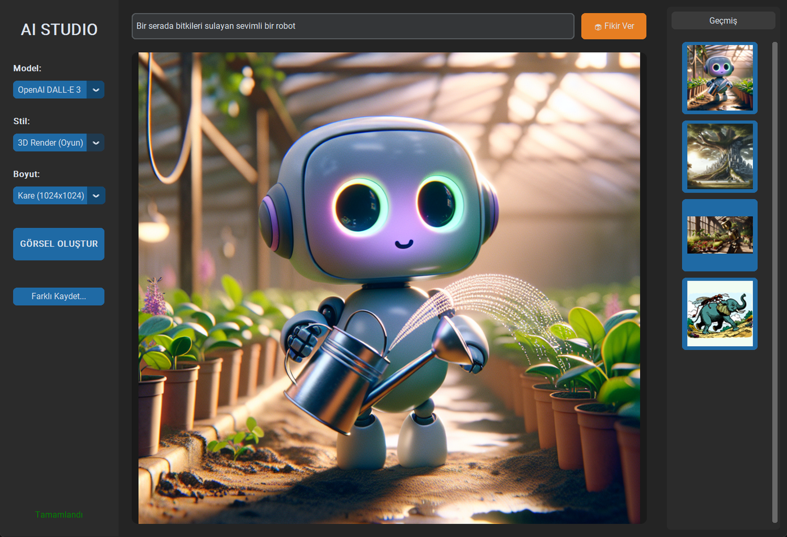
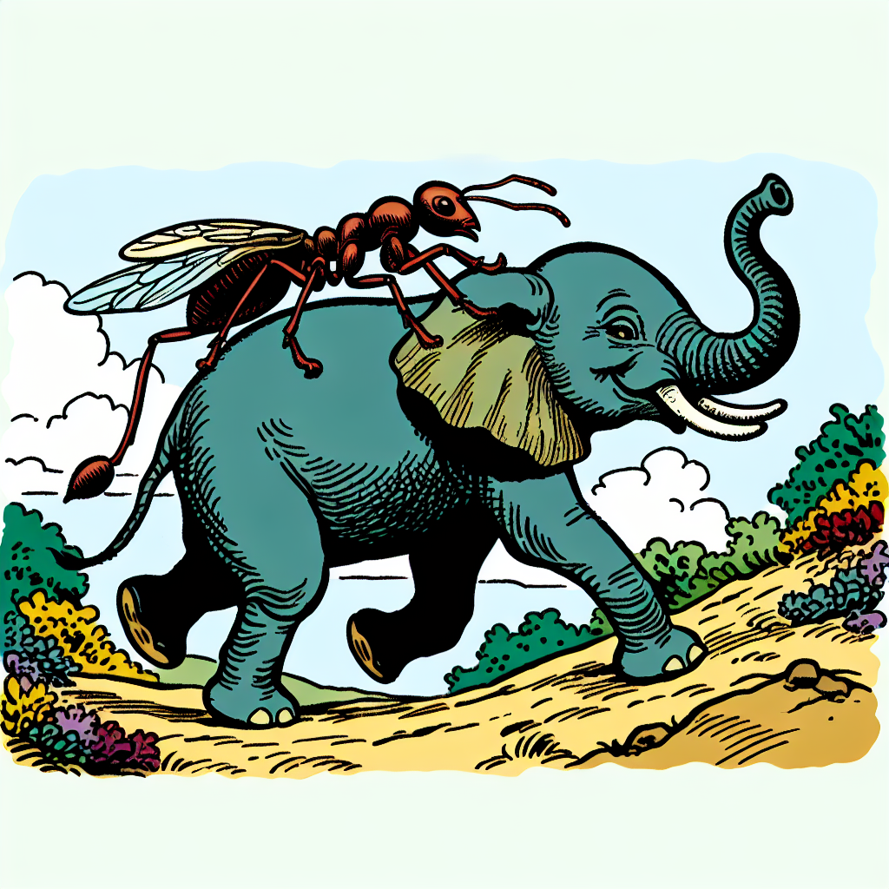

# AI Görsel İstasyonu

Metin açıklamasından yapay zekâ ile görsel üreten bir masaüstü uygulaması. Kullanıcı ne çizilmesini istediğini Türkçe ya da İngilizce yazıyor, hazır stil şablonlarından birini (gerçekçi fotoğraf, sinematik, 3D render, anime, cyberpunk) ve çıktı oranını seçiyor; uygulama isteği OpenAI DALL-E 3 API'sine gönderip dönen görseli ekranda gösteriyor, aynı anda diske kaydediyor ve oturum boyunca üretilen görselleri yan paneldeki geçmiş şeridinde saklıyor. Görsel üretimi arka plan thread'inde çalıştığı için istek sürerken arayüz donmuyor. Üretici katmanı Strategy deseniyle soyutlandığından yeni bir sağlayıcı eklemek tek bir sınıf yazmakla mümkün.

## Uygulama



Solda model, stil ve boyut seçimi; ortada üretilen görselin önizlemesi; sağda o oturumda üretilenlerin geçmiş şeridi.

## Örnek çıktılar

| | |
|---|---|
|  |  |
| *3D Render (Oyun)* stili — "Bir serada bitkileri sulayan sevimli bir robot" | *Sinematik Sahne* stili — "Dev bir ağacın üzerine kurulmuş fütüristik bir şehir" |


*Gerçekçi Fotoğraf* stili, 1792x1024 geniş format.



*Anime / Çizim* stili, 1024x1024.

## Kullanılan teknolojiler

| Teknoloji | Sürüm | Amaç |
|---|---|---|
| Python | 3.13 | Çalışma ortamı |
| CustomTkinter | 5.2.2 | Koyu temalı masaüstü arayüzü |
| Pillow | 12.0.0 | Görsel işleme, önizleme ve kaydetme |
| Requests | 2.32.5 | HTTP istekleri |
| python-dotenv | 1.2.1 | Ortam değişkeni yönetimi |
| OpenAI DALL-E 3 API | — | Görsel üretimi |

Mimari olarak `generators.py` içinde soyut bir `ImageGeneratorStrategy` arayüzü, `main.py` içinde ise arayüz ve uygulama akışı yer alır. Ağ işleri `threading` ile arka plana alınır, sonuç `after()` üzerinden ana thread'e döndürülür.

## Kurulum

Gereksinim: Python 3.10 veya üzeri (3.13 ile geliştirildi) ve geçerli bir OpenAI API anahtarı. Arayüz Tkinter kullanır; Windows ve macOS'ta Python ile birlikte gelir, Linux'ta ayrıca kurulması gerekebilir (`sudo apt install python3-tk`).

**1. Depoyu klonlayın**

```bash
git clone https://github.com/<kullanici-adi>/<depo-adi>.git
cd <depo-adi>
```

**2. Sanal ortam oluşturup etkinleştirin**

Windows:
```bash
python -m venv venv
venv\Scripts\activate
```

Linux / macOS:
```bash
python3 -m venv venv
source venv/bin/activate
```

**3. Bağımlılıkları kurun**

```bash
pip install -r requirements.txt
```

**4. Ortam değişkenlerini ayarlayın**

`.env.example` dosyasını `.env` olarak kopyalayın:

```bash
cp .env.example .env
```

Windows'ta `copy .env.example .env`. Ardından `.env` dosyasını açıp anahtarınızı girin:

| Değişken | Zorunlu | Açıklama |
|---|---|---|
| `OPENAI_API_KEY` | Evet | DALL-E 3 için gerekli. [platform.openai.com/api-keys](https://platform.openai.com/api-keys) adresinden alınır. |
| `HF_API_KEY` | Hayır | Yalnızca Hugging Face modeli seçilirse kullanılır. |
| `OUTPUT_DIR` | Hayır | Görsellerin kaydedileceği klasör. Boş bırakılırsa proje içindeki `fotolar` klasörü kullanılır. |
| `HF_MODEL_ID` | Hayır | Hugging Face model kimliği. Varsayılan: `black-forest-labs/FLUX.1-dev` |

`.env` dosyası `.gitignore` içinde olduğu için depoya gönderilmez.

**5. Çalıştırın**

```bash
python main.py
```

DALL-E 3 ücretli bir servistir; her görsel üretimi OpenAI hesabınızdan ücretlendirilir.

## Öne çıkan özellikler

- **Stil şablonları** — Seçilen stile göre kullanıcının yazdığı metnin sonuna hazır bir prompt eki ekleniyor, böylece kısa bir cümleden detaylı sonuç alınabiliyor.
- **Üç çıktı oranı** — Kare (1024x1024), yatay (1792x1024) ve dikey (1024x1792).
- **Donmayan arayüz** — Üretim isteği ayrı bir thread'de çalışıyor, sonuç ana thread'e `after()` ile aktarılıyor.
- **Otomatik kayıt** — Her görsel zaman damgalı bir dosya adıyla (`img_20251223_134728.png`) diske yazılıyor; ayrıca "Farklı Kaydet" ile istenen konuma kaydedilebiliyor.
- **Kalıcı geçmiş paneli** — Üretilen görsellerin küçük önizlemeleri sağ panelde listeleniyor, tıklayınca tam boyutta geri yükleniyor. Uygulama yeniden açıldığında kayıt klasöründeki son 20 görsel şeride geri yükleniyor; yükleme tek tek yapıldığı için açılış donmuyor.
- **İptal edilebilir üretim** — Üretim sürerken buton "İPTAL"e dönüşüyor. İptal edilen isteğin geç gelen sonucu artan bir üretim numarasıyla geçersiz sayılıyor: ne diske yazılıyor ne de ekrana geliyor.
- **Fikir ver** — Hazır örnek promptlardan rastgele biri metin kutusuna yazılıyor.
- **Genişletilebilir üretici katmanı** — Yeni bir sağlayıcı eklemek için `ImageGeneratorStrategy` arayüzünü uygulayan bir sınıf yazmak yeterli.

## Testler

`generators.py` için ağa çıkmayan, arayüz açmayan 18 birim testi var. HTTP katmanı sahte nesnelerle değiştiriliyor, bu yüzden API anahtarı olmadan da çalışıyorlar:

```bash
python -m unittest -v
```

## Bilinen eksikler

- **Hugging Face yolu doğrulanmadı.** Uç nokta, kapanmış olan `api-inference.huggingface.co` yerine güncel `router.huggingface.co` adresiyle değiştirildi; adresin ayakta olduğu doğrulandı (kimlik doğrulaması istiyor). Ancak elimde Hugging Face anahtarı olmadığı için uçtan uca bir üretim denenmedi. Adres ve model `HF_API_URL` / `HF_MODEL_ID` ile değiştirilebilir. OpenAI yolu birincil ve test edilmiş yoldur.
- **İptal, süren HTTP isteğini durdurmuyor.** İstek arka planda tamamlanıyor, sonucu yok sayılıyor. Kullanıcı açısından fark etmiyor ama iptal edilen bir DALL-E 3 üretimi yine de ücretlendirilir.
- **Arayüz için otomatik test yok.** Birim testleri üretici katmanını kapsıyor; arayüz elle test edildi.
- **Geçmiş şeridi kayıt klasörünün tamamını okuyor.** Klasöre dışarıdan konan PNG'ler de geçmişte görünür.

## Lisans

MIT
